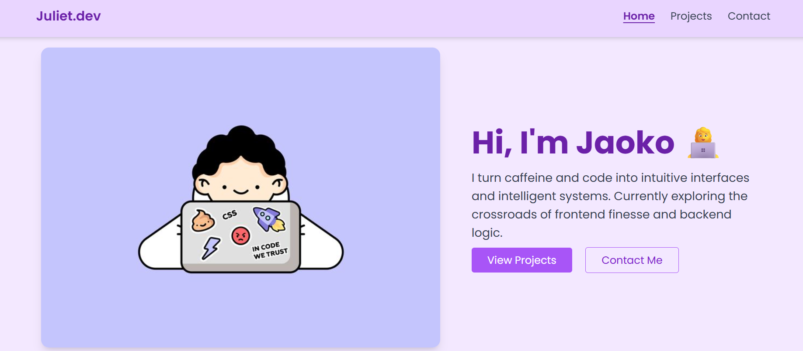

# 👩‍💻 Julie's Portfolio Website

Welcome to my personal portfolio! This site showcases my journey in software development, including my projects, skills, and contact details — all styled with Tailwind CSS and built with love and curiosity 💻💜

## 🌐 Live Demo  
[🔗 View Portfolio](https://juliet-portfolio.netlify.app/)

---

## ✨ Features
- 📱 Responsive design (mobile + desktop)
- 🎨 Light purple themed UI with soft visuals
- 🌀 Scroll-triggered transitions and animations
- 🎯 Semantic HTML5 + Tailwind CSS
- 💡 Interactive project cards with flip effects
- 📬 Dedicated contact page with social icons
- 🚀 Deployed via GitHub & Netlify

---

## 🛠 Tech Stack

| 🧰 Frontend     | 🛎️ Tools & Languages    |
|------------------|-------------------------|
| HTML5            | Visual Studio Code      |
| CSS3             | Git & GitHub            |
| Tailwind CSS     | Netlify (deployment)    |
| JavaScript       | Responsive Web Design   |

---
## 📸 Preview




## 🛠 Setup Instructions

To run this project locally on your machine:

1. **Clone the Repository**

```bash
git clone https://github.com/julietjaoko/julie-portfolio.git
```

2. **Navigate to the Project Folder**

```bash
cd julie-portfolio
```
3. **Open in a Code Editor**

If you're using VS Code:

```bash
code .
```
4. **Launch the Site**

You can open the index.html file in your browser manually, or install a live server:

```bash
# If you have Node.js installed
npm install -g live-server
live-server
```
Or just right-click index.html and choose "Open with Live Server" in VS Code.

💡 No frameworks or build tools are required. Just open the HTML files and you're good to go!


---

```markdown
> 💻 **This project is fully static** and runs in any modern browser.
```

## 🧠 Projects Highlight

### 📓 Personal Journal App

A Python console-based journaling tool with:
- ✍️ Daily notes
- 😄 Mood tracking
- 📊 Stats display
- 💬 Motivational quotes

**Tech Used:** Python, OOP
🔗 [View Code](https://github.com/julietjaoko/personal-journal)

---

### 🖼️ Responsive Portfolio Website

This website you're on right now! A fully custom responsive portfolio designed with clean layout and subtle motion.

###  Oracle Bookshop Database
A relational database management system used to store and manage university library books between the students, suppliers and university staff. It was implemented using Oracle SQL.

**Tech Used:** HTML, Tailwind CSS, GitHub, Netlify  
🔗 [View Code](https://github.com/julietjaoko/julie-portfolio)  
🌐 [Live Demo](https://juliet-portfolio.netlify.app/)

---


## 📜 License

This project is licensed under the MIT License.

Feel free to use, modify, and share — just don’t forget to credit! 😊

[Read the full license](LICENSE)
